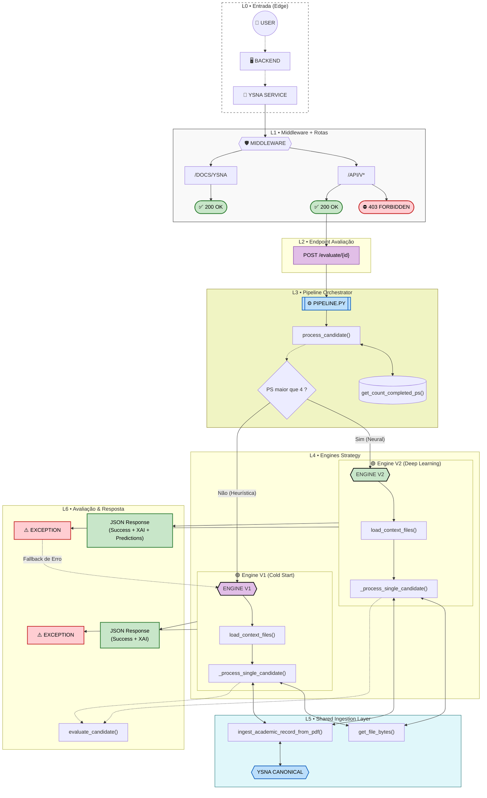

# Arquitetura do Sistema

```mermaid
flowchart TB

%% =========================
%% 1) ENTRADA / EDGE LAYER
%% =========================
subgraph L0["L0 • Entrada (Edge)"]
  direction TB
  U(("👤 USER"))
  BE["🖥️ BACKEND"]
  YSNA["🧠 YSNA SERVICE"]
  U -.-> BE
  BE -.-> YSNA
end

%% =========================
%% 2) MIDDLEWARE + ROTAS
%% =========================
subgraph L1["L1 • Middleware + Rotas"]
  direction TB
  MW{{"🛡️ MIDDLEWARE"}}
  APIv["/API/V*"]
  DOCS["/DOCS/YSNA"]

  YSNA --> MW
  MW --> APIv & DOCS

  APIv --> F403(["⛔ 403 FORBIDDEN"]):::bad
  APIv --> OK200(["✅ 200 OK"]):::ok
  DOCS --> DOCS200(["✅ 200 OK"]):::ok
end

%% =========================
%% 3) ENDPOINT PRINCIPAL
%% =========================
subgraph L2["L2 • Endpoint Avaliação"]
  direction TB
  EVAL["POST /evaluate/{id}"]:::endpoint
  OK200 --> EVAL
end

%% =========================
%% 4) PIPELINE PRINCIPAL
%% =========================
subgraph L3["L3 • Pipeline Orchestrator"]
  direction TB
  PIPE[["⚙️ PIPELINE.PY"]]:::core
  PROC["process_candidate()"]
  CNT[("get_count_completed_ps()")]

  EVAL --> PIPE --> PROC
  PROC <--> CNT

  GATE{"PS maior que 4 ?"}
  PROC -.-> GATE
end

%% =========================
%% 5) BRANCH ENGINES
%% =========================
subgraph L4["L4 • Engines Strategy"]
  direction TB
  
  %% Caminhos
  GATE -->|"Sim (Neural)"| V2
  GATE -->|"Não (Heurística)"| V1

  subgraph V1_BOX ["🟣 Engine V1 (Cold Start)"]
    direction TB
    V1{{ENGINE V1}}:::heuristic
    V1_CTX["load_context_files()"]
    V1_PROC["_process_single_candidate()"]
    V1 --> V1_CTX --> V1_PROC
  end

  subgraph V2_BOX ["🟢 Engine V2 (Deep Learning)"]
    direction TB
    V2{{ENGINE V2}}:::neural
    V2_CTX["load_context_files()"]
    V2_PROC["_process_single_candidate()"]
    V2 --> V2_CTX --> V2_PROC
  end
end

%% =========================
%% 6) INGESTÃO + CANONICAL
%% =========================
subgraph L5["L5 • Shared Ingestion Layer"]
  direction TB
  ING["ingest_academic_record_from_pdf()"]
  GETB["get_file_bytes()"]
  CAN{{YSNA CANONICAL}}:::core

  V1_PROC & V2_PROC <--> GETB
  V1_PROC & V2_PROC <--> ING
  ING <--> CAN
end

%% =========================
%% 7) AVALIAÇÃO + RETORNO
%% =========================
subgraph L6["L6 • Avaliação & Resposta"]
  direction TB
  EVALC["evaluate_candidate()"]
  
  RET_V1["JSON Response<br/>(Success + XAI)"]:::ok
  RET_V2["JSON Response<br/>(Success + XAI + Predictions)"]:::ok

  ERR_V1["⚠️ EXCEPTION"]:::bad
  ERR_V2["⚠️ EXCEPTION"]:::bad

  V1_PROC -.-> EVALC 
  V2_PROC -.-> EVALC

  %% Conexões de Retorno Lógico (Simplificadas visualmente)
  V1_BOX --> RET_V1
  V1_BOX --> ERR_V1
  
  V2_BOX --> RET_V2
  V2_BOX --> ERR_V2
end

%% =========================
%% 8) FALLBACK (O Pulo do Gato)
%% =========================
ERR_V2 -.->|"Fallback de Erro"| V1

%% =========================
%% ESTILOS
%% =========================
classDef ok fill:#C8E6C9,stroke:#2E7D32,color:#000,stroke-width:2px;
classDef bad fill:#FFCDD2,stroke:#C62828,color:#000,stroke-width:2px;
classDef core fill:#BBDEFB,stroke:#1565C0,color:#000,stroke-width:2px;
classDef endpoint fill:#E1BEE7,stroke:#6A1B9A,color:#000;
classDef neural fill:#C8E6C9,stroke:#000,stroke-width:2px;
classDef heuristic fill:#E1BEE7,stroke:#000,stroke-width:2px;

style L0 fill:#fff,stroke:#333,stroke-width:1px,stroke-dasharray: 5 5
style L1 fill:#f9f9f9,stroke:#333
style L3 fill:#f0f4c3,stroke:#827717
style L5 fill:#e0f7fa,stroke:#006064
```