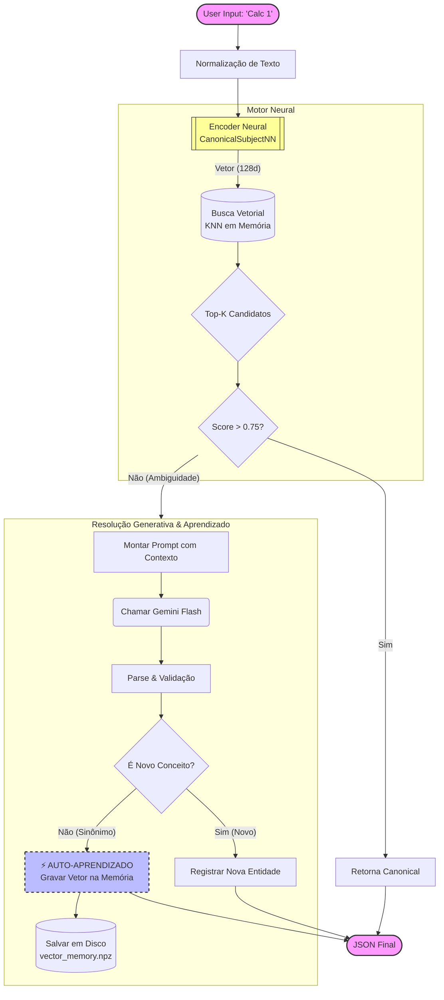

# Arquitetura do Sistema

```mermaid
flowchart TD
    %% Nós de Entrada e Saída
    Input([User Input: 'Calc 1']) --> PreProcess[Normalização de Texto]
    PreProcess --> Encoder[[Encoder Neural \n CanonicalSubjectNN]]
    
    %% O Coração Neural
    subgraph Neural_Engine [Motor Neural]
        direction TB
        Encoder -- Vetor (128d) --> VectorSearch[(Busca Vetorial \n KNN em Memória)]
        VectorSearch --> Candidates{Top-K Candidatos}
        Candidates --> CheckThreshold{Score > 0.75?}
    end

    %% Caminho Rápido (Memória)
    CheckThreshold -- Sim --> FastPath[Retorna Canonical]
    FastPath --> Output([JSON Final])

    %% Caminho Lento (LLM / Fallback)
    CheckThreshold -- Não (Ambiguidade) --> LLM_Flow
    
    subgraph LLM_Flow [Resolução Generativa & Aprendizado]
        direction TB
        Prompt[Montar Prompt com Contexto]
        Prompt --> CallGemini(Chamar Gemini Flash)
        CallGemini --> ParseJSON[Parse & Validação]
        
        ParseJSON --> Decision{É Novo Conceito?}
        Decision -- Não (Sinônimo) --> UpdateMem[⚡ AUTO-APRENDIZADO \n Gravar Vetor na Memória]
        Decision -- Sim (Novo) --> LogNew[Registrar Nova Entidade]
        
        UpdateMem --> Persist[(Salvar em Disco \n vector_memory.npz)]
    end
    
    UpdateMem --> Output
    LogNew --> Output

    %% Estilização
    style Input fill:#f9f,stroke:#333,stroke-width:2px
    style Output fill:#f9f,stroke:#333,stroke-width:2px
    style UpdateMem fill:#bbf,stroke:#333,stroke-width:2px,stroke-dasharray: 5 5
    style Encoder fill:#ff9,stroke:#333
```