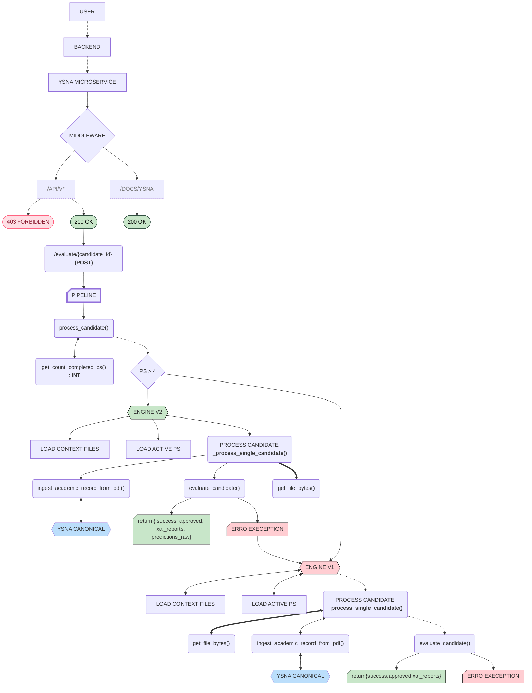

# Arquitetura do Sistema

```mermaid
flowchart TB
    n1["USER"] -.-> n2["BACKEND"]
    n2 -.-> n3["YSNA MICROSERVICE"]
    n3 --> n4["MIDDLEWARE"]
    n4 --> n7["/API/V*"] & n8["/DOCS/YSNA"]
    n7 --> n5(["403 FORBIDDEN"]) & n6(["200 OK"])
    n8 --> n9(["200 OK"])
    n6 --> n10@{ label: "<span style=\"font-family:\">/evaluate/</span><span style=\"font-family:\">{candidate_id} **(POST)**</span>" }
    n10 --> n11["PIPELINE"]
    n11 --> n12@{ label: "<span style=\"color:\">process_candidate()</span>" }
    n12 <--> n13@{ label: "<span style=\"color:\">get_count_completed_ps() : **INT**</span>" }
    n12 -.-> n14["PS &gt; 4"]
    n14 --> n15["ENGINE V2"] & n16["ENGINE V1"]
    n16 <--> n17["LOAD CONTEXT FILES"] & n18["LOAD ACTIVE PS"]
    n16 -.-> n19@{ label: "PROCESS CANDIDATE **<span style=\"color:\">_process_single_candidate()**</span>" }
    n19 <==> n20@{ label: "<div style=\"color:\"><span style=\"color:\">get_file_bytes()</span></div>" }
    n19 <--> n21@{ label: "<div style=\"color:\"><span style=\"color:\">ingest_academic_record_from_pdf()</span></div>" }
    n21 <--> n22["YSNA CANONICAL"]
    n19 -.-> n23@{ label: "<div style=\"color:\"><span style=\"color:\">evaluate_candidate()</span></div>" }
    n23 --> n24@{ label: "<span style=\"--tw-scale-x:\">return</span><span style=\"--tw-scale-x:\">{</span><span style=\"--tw-scale-x:\"></span><span style=\"--tw-scale-x:\">success</span><span style=\"--tw-scale-x:\">,</span><span style=\"--tw-scale-x:\"></span><span style=\"--tw-scale-x:\">approved,</span><span style=\"--tw-scale-x:\">xai_reports</span><span style=\"--tw-scale-x:\">}</span>" } & n25["ERRO EXECEPTION"]
    n15 --> n26["LOAD CONTEXT FILES"] & n27["LOAD ACTIVE PS"] & n28@{ label: "PROCESS CANDIDATE **<span style=\"color:\">_process_single_candidate()**</span>" }
    n30@{ label: "<div style=\"color:\"><span style=\"color:\">ingest_academic_record_from_pdf()</span></div>" } <--> n31["YSNA CANONICAL"]
    n28 --> n30 & n32@{ label: "<div style=\"color:\"><span style=\"color:\">evaluate_candidate()</span></div>" }
    n28 <==> n29@{ label: "<div style=\"color:\"><span style=\"color:\">get_file_bytes()</span></div>" }
    n32 --> n33@{ label: "<span style=\"font-family:\">return</span><span style=\"color:\"> { success, approved, xai_reports, predictions_raw}</span>" } & n34["ERRO EXECEPTION"]
    n34 --> n16

    n1@{ shape: rect}
    n4@{ shape: diam}
    n7@{ shape: rect}
    n10@{ shape: rounded}
    n11@{ shape: card}
    n12@{ shape: rounded}
    n13@{ shape: rounded}
    n14@{ shape: diam}
    n15@{ shape: hex}
    n16@{ shape: hex}
    n18@{ shape: rect}
    n19@{ shape: rounded}
    n20@{ shape: rounded}
    n21@{ shape: rounded}
    n22@{ shape: hex}
    n23@{ shape: rounded}
    n24@{ shape: card}
    n25@{ shape: card}
    n27@{ shape: rect}
    n28@{ shape: rounded}
    n30@{ shape: rounded}
    n31@{ shape: hex}
    n32@{ shape: rounded}
    n29@{ shape: rounded}
    n33@{ shape: card}
    n34@{ shape: card}
     n5:::Rose
     n6:::Pine
     n9:::Pine
    classDef Rose stroke-width:1px, stroke-dasharray:none, stroke:#FF5978, fill:#FFDFE5, color:#8E2236
    classDef Pine stroke-width:1px, stroke-dasharray:none, stroke:#254336, fill:#27654A, color:#FFFFFF
    style n2 stroke-width:2px,stroke-dasharray: 0
    style n3 stroke-width:2px,stroke-dasharray: 0
    style n7 stroke-width:1px,stroke-dasharray: 1,color:#757575
    style n8 stroke-width:1px,stroke-dasharray: 1,color:#757575
    style n6 color:#000000,fill:#C8E6C9
    style n9 color:#000000,fill:#C8E6C9
    style n11 stroke-width:4px,stroke-dasharray: 0
    style n12 stroke-width:2px,stroke-dasharray: 0
    style n15 stroke:#000000,fill:#C8E6C9
    style n16 stroke:#000000,fill:#FFCDD2
    style n22 fill:#BBDEFB
    style n24 color:#000000,stroke:#000000,fill:#C8E6C9
    style n25 stroke:#000000,fill:#FFCDD2
    style n31 fill:#BBDEFB
    style n33 color:#000000,stroke:#000000,fill:#C8E6C9
    style n34 stroke:#000000,fill:#FFCDD2
```